## 1. Load libraries and packages

```python
from statsmodels.tsa.ar_model import AutoRegResults
```

```python
import pandas as pd 
import numpy as np 

# Visualization
import matplotlib.pyplot as plt
import seaborn as sns
from pylab import rcParams
import plotly.figure_factory as ff
from statsmodels.graphics.tsaplots import plot_predict

# Machine Learning
import sklearn
## Pipeline
from sklearn.pipeline import Pipeline
## Column Transformer
from sklearn.compose import ColumnTransformer
from sklearn.base import BaseEstimator, TransformerMixin
from sklearn.preprocessing import MinMaxScaler, OneHotEncoder
from sklearn.metrics import mean_squared_error

## Feature Union for Customized Class 
from sklearn.pipeline import FeatureUnion

# Statistics
from statsmodels.graphics.tsaplots import plot_acf, plot_pacf
# Cross-sectional models and methods
import statsmodels.api as sm

# Augmented Dicker Fuller Test for Stationary vs Random Walk
from statsmodels.tsa.stattools import adfuller

# Random array
from numpy.random import normal, seed
from plotly.offline import iplot

# Modeling 
## Autoregressive Model
from statsmodels.tsa.arima_process import ArmaProcess
from statsmodels.tsa.ar_model import AutoReg, ar_select_order
## Moving Average Model
# from statsmodels.tsa.arima.model import ARMA
from statsmodels.tsa.arima.model import ARIMA

# Mathematic operations
import math

```

- `FeatureUnion` is a class from scikit-learn used to combine the outputs of multiple transformer objects into a single feature space.
    - It allows parallel application of different data preprocessing steps (e.g. scaling, encoding, feature extraction) on the same input dataset, then concatenates their results column-wise—similar to `ColumnTransformer`, but typically applied to the same columns rather than different ones.
- `MinMaxScaler` is a preprocessing class from sklearn.preprocessing used to scale numerical features to a fixed range, typically [0, 1].
    - It transforms data by subtracting the minimum value and dividing by the range (max – min), ensuring all features contribute equally to model training, especially important in algorithms sensitive to input scale like neural networks or distance-based models.
- `BaseEstimator` is a base class in scikit-learn used to define estimator interfaces.
    - It provides a foundational structure for creating custom machine learning estimators in Python, ensuring compatibility with scikit-learn's tools like pipelines and model selection utilities. Though not used directly, it enforces consistent method signatures (e.g., fit, get_params, set_params) across all estimators.
- `TransformerMixin` is a class mixin from scikit-learn that enables custom transformer classes to integrate seamlessly with scikit-learn's pipeline system.
    - It provides a standard fit_transform method so that any class inheriting from it can be used in a Pipeline or FeatureUnion without requiring boilerplate code. This is essential for building reusable, composable data preprocessing workflows.
- `rcParams` is a configuration object used to customize default settings in Matplotlib visualizations.
    - It allows users to globally adjust figure size, font, style, and other plot parameters without repeating settings across plots. This improves consistency and reduces boilerplate code in data visualization workflows.

## Dataset Information

1. [DJIA 30 Stock Time Series](https://www.kaggle.com/datasets/szrlee/stock-time-series-20050101-to-20171231)
2. [Historical Hourly Weather Data 2012-2017](https://www.kaggle.com/datasets/selfishgene/historical-hourly-weather-data)

- Brief description of datasets:
    - Data being used:
        - Google Stock Data
        - Humidity in different world cities
        - Microsoft Stock Data
        - Pressure in different world cities


```python
# import kagglehub

# # Download latest version
# path = kagglehub.dataset_download("szrlee/stock-time-series")

# print("Path to dataset files:", path)
```


```python
# # Download latest version
# path = kagglehub.dataset_download("selfishgene/historical-hourly-weather-data")

# print("Path to dataset files:", path)
```


```python
google_stock = pd.read_csv("stock-time-series\GOOGL_2006-01-01_to_2018-01-01.csv", index_col="Date", parse_dates=["Date"])
google_stock.head()
```    


<div>
<style scoped>
    .dataframe tbody tr th:only-of-type {
        vertical-align: middle;
    }

    .dataframe tbody tr th {
        vertical-align: top;
    }

    .dataframe thead th {
        text-align: right;
    }
</style>
<table border="1" class="dataframe">
  <thead>
    <tr style="text-align: right;">
      <th></th>
      <th>Open</th>
      <th>High</th>
      <th>Low</th>
      <th>Close</th>
      <th>Volume</th>
      <th>Name</th>
    </tr>
    <tr>
      <th>Date</th>
      <th></th>
      <th></th>
      <th></th>
      <th></th>
      <th></th>
      <th></th>
    </tr>
  </thead>
  <tbody>
    <tr>
      <th>2006-01-03</th>
      <td>211.47</td>
      <td>218.05</td>
      <td>209.32</td>
      <td>217.83</td>
      <td>13137450</td>
      <td>GOOGL</td>
    </tr>
    <tr>
      <th>2006-01-04</th>
      <td>222.17</td>
      <td>224.70</td>
      <td>220.09</td>
      <td>222.84</td>
      <td>15292353</td>
      <td>GOOGL</td>
    </tr>
    <tr>
      <th>2006-01-05</th>
      <td>223.22</td>
      <td>226.00</td>
      <td>220.97</td>
      <td>225.85</td>
      <td>10815661</td>
      <td>GOOGL</td>
    </tr>
    <tr>
      <th>2006-01-06</th>
      <td>228.66</td>
      <td>235.49</td>
      <td>226.85</td>
      <td>233.06</td>
      <td>17759521</td>
      <td>GOOGL</td>
    </tr>
    <tr>
      <th>2006-01-09</th>
      <td>233.44</td>
      <td>236.94</td>
      <td>230.70</td>
      <td>233.68</td>
      <td>12795837</td>
      <td>GOOGL</td>
    </tr>
  </tbody>
</table>
</div>


```python
humidity = pd.read_csv("historical-hourly-weather-data\humidity.csv", index_col="datetime", parse_dates=["datetime"])
humidity.tail()
```


<div>
<style scoped>
    .dataframe tbody tr th:only-of-type {
        vertical-align: middle;
    }

    .dataframe tbody tr th {
        vertical-align: top;
    }

    .dataframe thead th {
        text-align: right;
    }
</style>
<table border="1" class="dataframe">
  <thead>
    <tr style="text-align: right;">
      <th></th>
      <th>Vancouver</th>
      <th>Portland</th>
      <th>San Francisco</th>
      <th>Seattle</th>
      <th>Los Angeles</th>
      <th>San Diego</th>
      <th>Las Vegas</th>
      <th>Phoenix</th>
      <th>Albuquerque</th>
      <th>Denver</th>
      <th>...</th>
      <th>Philadelphia</th>
      <th>New York</th>
      <th>Montreal</th>
      <th>Boston</th>
      <th>Beersheba</th>
      <th>Tel Aviv District</th>
      <th>Eilat</th>
      <th>Haifa</th>
      <th>Nahariyya</th>
      <th>Jerusalem</th>
    </tr>
    <tr>
      <th>datetime</th>
      <th></th>
      <th></th>
      <th></th>
      <th></th>
      <th></th>
      <th></th>
      <th></th>
      <th></th>
      <th></th>
      <th></th>
      <th></th>
      <th></th>
      <th></th>
      <th></th>
      <th></th>
      <th></th>
      <th></th>
      <th></th>
      <th></th>
      <th></th>
      <th></th>
    </tr>
  </thead>
  <tbody>
    <tr>
      <th>2017-11-29 20:00:00</th>
      <td>NaN</td>
      <td>81.0</td>
      <td>NaN</td>
      <td>93.0</td>
      <td>24.0</td>
      <td>72.0</td>
      <td>18.0</td>
      <td>68.0</td>
      <td>37.0</td>
      <td>18.0</td>
      <td>...</td>
      <td>27.0</td>
      <td>NaN</td>
      <td>64.0</td>
      <td>37.0</td>
      <td>NaN</td>
      <td>NaN</td>
      <td>NaN</td>
      <td>NaN</td>
      <td>NaN</td>
      <td>NaN</td>
    </tr>
    <tr>
      <th>2017-11-29 21:00:00</th>
      <td>NaN</td>
      <td>71.0</td>
      <td>NaN</td>
      <td>87.0</td>
      <td>21.0</td>
      <td>72.0</td>
      <td>18.0</td>
      <td>73.0</td>
      <td>34.0</td>
      <td>12.0</td>
      <td>...</td>
      <td>29.0</td>
      <td>NaN</td>
      <td>59.0</td>
      <td>74.0</td>
      <td>NaN</td>
      <td>NaN</td>
      <td>NaN</td>
      <td>NaN</td>
      <td>NaN</td>
      <td>NaN</td>
    </tr>
    <tr>
      <th>2017-11-29 22:00:00</th>
      <td>NaN</td>
      <td>71.0</td>
      <td>NaN</td>
      <td>93.0</td>
      <td>23.0</td>
      <td>68.0</td>
      <td>17.0</td>
      <td>60.0</td>
      <td>32.0</td>
      <td>15.0</td>
      <td>...</td>
      <td>31.0</td>
      <td>NaN</td>
      <td>66.0</td>
      <td>74.0</td>
      <td>NaN</td>
      <td>NaN</td>
      <td>NaN</td>
      <td>NaN</td>
      <td>NaN</td>
      <td>NaN</td>
    </tr>
    <tr>
      <th>2017-11-29 23:00:00</th>
      <td>NaN</td>
      <td>71.0</td>
      <td>NaN</td>
      <td>87.0</td>
      <td>14.0</td>
      <td>63.0</td>
      <td>17.0</td>
      <td>33.0</td>
      <td>30.0</td>
      <td>28.0</td>
      <td>...</td>
      <td>26.0</td>
      <td>NaN</td>
      <td>58.0</td>
      <td>56.0</td>
      <td>NaN</td>
      <td>NaN</td>
      <td>NaN</td>
      <td>NaN</td>
      <td>NaN</td>
      <td>NaN</td>
    </tr>
    <tr>
      <th>2017-11-30 00:00:00</th>
      <td>NaN</td>
      <td>76.0</td>
      <td>NaN</td>
      <td>75.0</td>
      <td>56.0</td>
      <td>72.0</td>
      <td>17.0</td>
      <td>23.0</td>
      <td>34.0</td>
      <td>31.0</td>
      <td>...</td>
      <td>32.0</td>
      <td>NaN</td>
      <td>58.0</td>
      <td>56.0</td>
      <td>NaN</td>
      <td>NaN</td>
      <td>NaN</td>
      <td>NaN</td>
      <td>NaN</td>
      <td>NaN</td>
    </tr>
  </tbody>
</table>
<p>5 rows × 36 columns</p>
</div>


```python
# Set color palette
palette = sns.color_palette("Set2") 
```

## 2. Exploration Data Analysis


### 2.1 Stock Dataset


```python
google_stock.info()
```

    <class 'pandas.core.frame.DataFrame'>
    DatetimeIndex: 3019 entries, 2006-01-03 to 2017-12-29
    Data columns (total 6 columns):
     #   Column  Non-Null Count  Dtype  
    ---  ------  --------------  -----  
     0   Open    3019 non-null   float64
     1   High    3019 non-null   float64
     2   Low     3019 non-null   float64
     3   Close   3019 non-null   float64
     4   Volume  3019 non-null   int64  
     5   Name    3019 non-null   object 
    dtypes: float64(4), int64(1), object(1)
    memory usage: 165.1+ KB
    

- Dataset of Google Stock includes:
    - Feature list:
        - 6 columns: Open, High, Low, Close, Volume
        - DatatimeIndex
            - Data range: 2006-01-03 to 2017-12-29
            - Frequency: Daily
        - Detail:
            - Date - in format: yy-mm-dd
            - Open - price of the stock at market open (this is NYSE data so all in USD)
            - High - Highest price reached in the day
            - Low - Lowest price reached in the day
            - Close - price of the stock at market close
            - Volume - Number of shares traded
            - Name - the stock's ticker name
    - Number of record: 3019
- Business Understanding:
    - Stock price for each day has 6 characteristics should be care:
        - Open price
        - Close price
        - Highest price
        - Lowest price
        - Volume: The number of stock transactions
        - Adjust close price: Have been existed in this dataset


```python
pd.date_range(start='2006-01-03', end='2017-12-29')
```


    DatetimeIndex(['2006-01-03', '2006-01-04', '2006-01-05', '2006-01-06',
                   '2006-01-07', '2006-01-08', '2006-01-09', '2006-01-10',
                   '2006-01-11', '2006-01-12',
                   ...
                   '2017-12-20', '2017-12-21', '2017-12-22', '2017-12-23',
                   '2017-12-24', '2017-12-25', '2017-12-26', '2017-12-27',
                   '2017-12-28', '2017-12-29'],
                  dtype='datetime64[ns]', length=4379, freq='D')


- About time range:
    - Existing the missing data in some days (4379 > 3019). 


```python
google_stock.isnull().sum()
```


    Open      0
    High      0
    Low       0
    Close     0
    Volume    0
    Name      0
    dtype: int64


```python
google_stock.duplicated().sum()
```

    np.int64(0)


```python
google_stock.describe()
```


<div>
<style scoped>
    .dataframe tbody tr th:only-of-type {
        vertical-align: middle;
    }

    .dataframe tbody tr th {
        vertical-align: top;
    }

    .dataframe thead th {
        text-align: right;
    }
</style>
<table border="1" class="dataframe">
  <thead>
    <tr style="text-align: right;">
      <th></th>
      <th>Open</th>
      <th>High</th>
      <th>Low</th>
      <th>Close</th>
      <th>Volume</th>
    </tr>
  </thead>
  <tbody>
    <tr>
      <th>count</th>
      <td>3019.000000</td>
      <td>3019.000000</td>
      <td>3019.000000</td>
      <td>3019.000000</td>
      <td>3.019000e+03</td>
    </tr>
    <tr>
      <th>mean</th>
      <td>428.200802</td>
      <td>431.835618</td>
      <td>424.130275</td>
      <td>428.044001</td>
      <td>3.551504e+06</td>
    </tr>
    <tr>
      <th>std</th>
      <td>236.320026</td>
      <td>237.514087</td>
      <td>234.923747</td>
      <td>236.343238</td>
      <td>3.038599e+06</td>
    </tr>
    <tr>
      <th>min</th>
      <td>131.390000</td>
      <td>134.820000</td>
      <td>123.770000</td>
      <td>128.850000</td>
      <td>5.211410e+05</td>
    </tr>
    <tr>
      <th>25%</th>
      <td>247.775000</td>
      <td>250.190000</td>
      <td>244.035000</td>
      <td>247.605000</td>
      <td>1.760854e+06</td>
    </tr>
    <tr>
      <th>50%</th>
      <td>310.480000</td>
      <td>312.810000</td>
      <td>307.790000</td>
      <td>310.080000</td>
      <td>2.517630e+06</td>
    </tr>
    <tr>
      <th>75%</th>
      <td>572.140000</td>
      <td>575.975000</td>
      <td>565.900000</td>
      <td>570.770000</td>
      <td>4.242182e+06</td>
    </tr>
    <tr>
      <th>max</th>
      <td>1083.020000</td>
      <td>1086.490000</td>
      <td>1072.270000</td>
      <td>1085.090000</td>
      <td>4.118289e+07</td>
    </tr>
  </tbody>
</table>
</div>


- About the variability:
    - Haven't found any great range between Open, High, Low, Close in almost all of the statistical metrics.


```python
google_stock.shape
```


    (3019, 6)


#### 2.1.1. Growth rate daily of Google stock

- Growth rate is the percentage change in the value of a variable over a period of time.
    - The important metric in stock market.
    - Formula: Current Value / Previous Value


```python
# Percent change in Highest price of Google stock
## Option 1: pct_change() method
google_stock['High'].pct_change(freq='D').add(1).plot(figsize=(20,8), color = palette[2])
## Option 2: div() 
# google_stock['High'].div(google_stock['High'].shift(1, freq='D')).plot(figsize=(20,8))
```


    <Axes: xlabel='Date'>

    
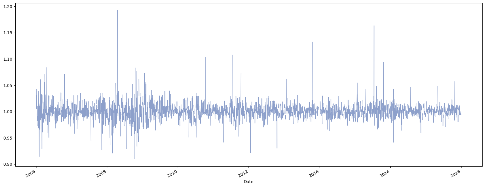
    

```python
google_stock['Change'] = google_stock['High'].div(google_stock['High'].shift(1, freq='D'))

```


```python
# Percent change in Lowest price of Google stock
google_stock['Low'].pct_change(periods=1, freq='D').add(1).plot(figsize=(20,8), color = palette[2])
```


    <Axes: xlabel='Date'>

    
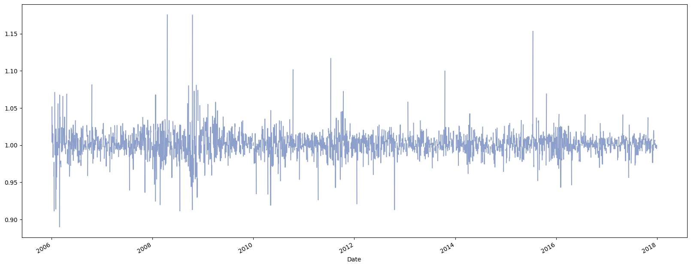
    

```python
# Percent change in Open price of Google stock
google_stock['Open'].pct_change(periods=1, freq='D').add(1).plot(figsize=(20,8), color = palette[2])
```


    <Axes: xlabel='Date'>

    
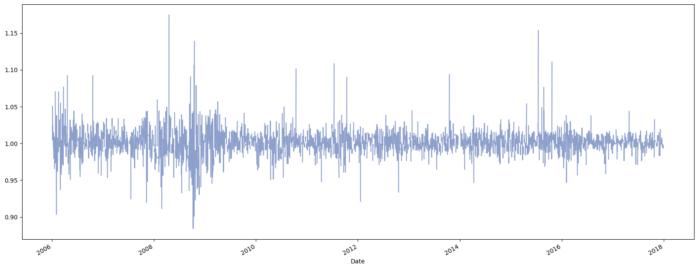
    

```python
# Percent change in Close price of Google stock
google_stock['Close'].pct_change(periods=1, freq='D').add(1).plot(figsize=(20,8), color = palette[2])
```


    <Axes: xlabel='Date'>

    
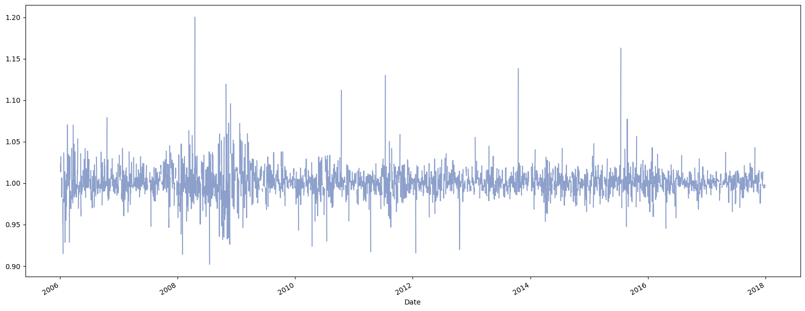
    

```python
# Percent change in Volume of Google stock
google_stock['Volume'].pct_change(periods=1, freq='D').add(1).plot(figsize=(20,8), color = palette[2])
```


    <Axes: xlabel='Date'>

    
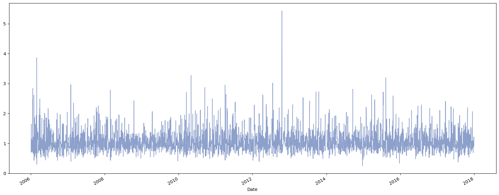
    

#### 2.1.2. Stock returns

-  Stock return is the percentage of change in the stock price from one period to the next.
    - Formula: (Current Value - Previous Value) / Previous Value


```python
google_stock['Change'].sub(1).mul(100)
```


    Date
    2006-01-03         NaN
    2006-01-04    3.049759
    2006-01-05    0.578549
    2006-01-06    4.199115
    2006-01-09         NaN
                    ...   
    2017-12-22   -0.538273
    2017-12-26         NaN
    2017-12-27   -0.055199
    2017-12-28   -0.321080
    2017-12-29   -0.637654
    Name: Change, Length: 3019, dtype: float64


```python
google_stock['Change'].sub(1).mul(100).plot(figsize=(20,8), color = palette[2])
```


    <Axes: xlabel='Date'>

    
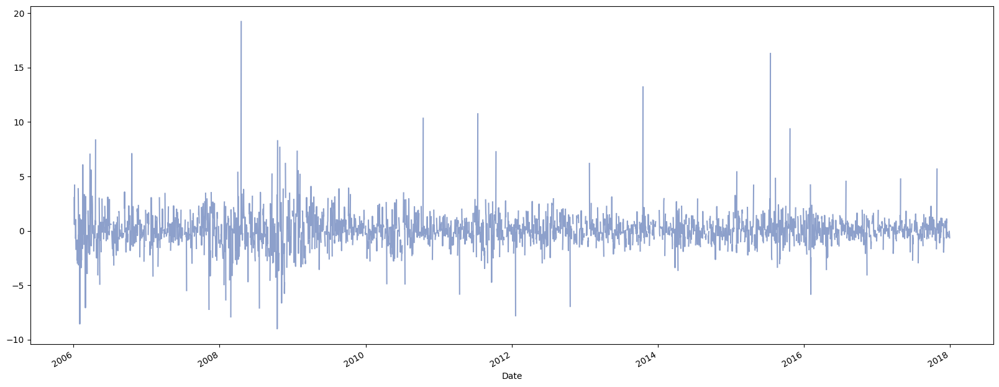
    

- `sub` is a method used to perform element-wise subtraction on a pandas Series or DataFrame.
    - It is typically called on a data column to subtract a scalar value or another series from each element, often used in financial or time-series calculations to compute changes or differences.
    - This line computes the percentage change by:
        - Subtracting 1 from each value in the 'Change' column (assumed to represent multiplicative factors, e.g., 1.05 for a 5% increase)
        - Multiplying the result by 100 to convert to a percentage

- `mul` is a method used to perform element-wise multiplication on data structures.
    - It is commonly used in data analysis workflows to scale or transform numerical values, particularly in pandas DataFrame or Series objects, though its exact implementation depends on the context in which it is called.
    - Purpose: Scales numerical data by a specified factor (here, 100) element-wise.
    - Object context: Likely a pandas Series or similar vectorized numeric type.
    - Returns: A new Series with each element multiplied by the argument.
    - Side effects: None — it is a pure transformation function.


```python
google_stock['High'].pct_change().add(1)
```


    Date
    2006-01-03         NaN
    2006-01-04    1.030498
    2006-01-05    1.005785
    2006-01-06    1.041991
    2006-01-09    1.006157
                    ...   
    2017-12-22    0.994617
    2017-12-26    0.997331
    2017-12-27    0.999448
    2017-12-28    0.996789
    2017-12-29    0.993623
    Name: High, Length: 3019, dtype: float64


```python
google_stock['High'].pct_change()
```


    Date
    2006-01-03         NaN
    2006-01-04    0.030498
    2006-01-05    0.005785
    2006-01-06    0.041991
    2006-01-09    0.006157
                    ...   
    2017-12-22   -0.005383
    2017-12-26   -0.002669
    2017-12-27   -0.000552
    2017-12-28   -0.003211
    2017-12-29   -0.006377
    Name: High, Length: 3019, dtype: float64


```python
google_stock['High'].div(google_stock['High'].shift(1, freq='D')).sub(1)
```


    Date
    2006-01-03         NaN
    2006-01-04    0.030498
    2006-01-05    0.005785
    2006-01-06    0.041991
    2006-01-07         NaN
                    ...   
    2017-12-26         NaN
    2017-12-27   -0.000552
    2017-12-28   -0.003211
    2017-12-29   -0.006377
    2017-12-30         NaN
    Name: High, Length: 3672, dtype: float64


```python
google_stock['High'].pct_change().mul(100) # Another way to calculate return
```


    Date
    2006-01-03         NaN
    2006-01-04    3.049759
    2006-01-05    0.578549
    2006-01-06    4.199115
    2006-01-09    0.615737
                    ...   
    2017-12-22   -0.538273
    2017-12-26   -0.266861
    2017-12-27   -0.055199
    2017-12-28   -0.321080
    2017-12-29   -0.637654
    Name: High, Length: 3019, dtype: float64


#### 2.1.3. Specific value of change


```python
google_stock['High'].diff(periods = 1)
```


    Date
    2006-01-03     NaN
    2006-01-04    6.65
    2006-01-05    1.30
    2006-01-06    9.49
    2006-01-09    1.45
                  ... 
    2017-12-22   -5.80
    2017-12-26   -2.86
    2017-12-27   -0.59
    2017-12-28   -3.43
    2017-12-29   -6.79
    Name: High, Length: 3019, dtype: float64


```python
google_stock['High'].diff(periods = 1).plot(figsize = (20, 8), color = palette[2])
```


    <Axes: xlabel='Date'>

    
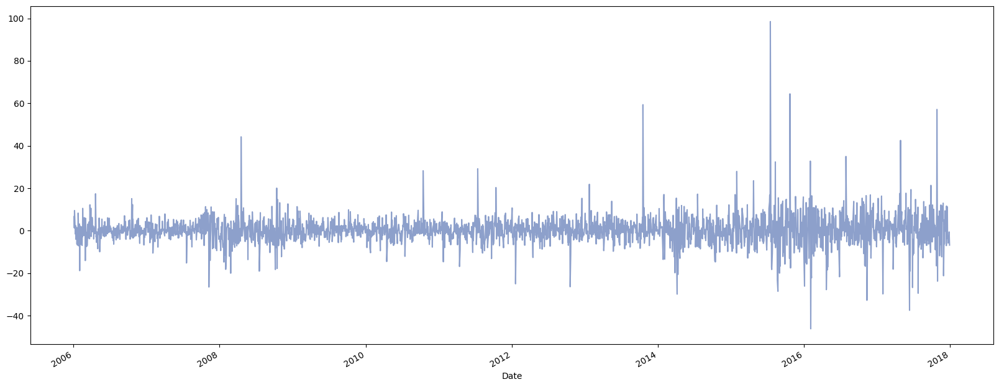
    

- `diff` is a method used to compute the difference between consecutive elements in a time series or sequence.
    - It is commonly applied in data analysis and time series modeling to transform non-stationary data into stationary data by removing trends, which helps in preparing data for statistical modeling such as ARIMA or other forecasting techniques.


#### 2.1.4. Compare two or more timeseries


- Compare 2 time series by normalizing them. 
    - Normalization: Dividing by each time series element of all time series by the first element.
        - Dividing by the start date of each time series.


```python
# Import dataset of microsoft stock
microsoft_stock = pd.read_csv('stock-time-series\MSFT_2006-01-01_to_2018-01-01.csv', 
                        index_col='Date', 
                        parse_dates=['Date'])
```

```python
# Ploting the absolute value of the Highest price in each time series
google_stock['High'].plot(color = palette[2])
microsoft_stock['High'].plot(color = palette[3])
plt.legend(['Google', 'Microsoft'])
plt.show()

```

  
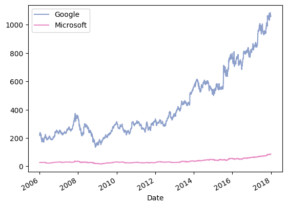
    

```python
# Normalizing and Comparison both stocks 
normalized_google_stock = google_stock['High'].div(google_stock['High'].iloc[0]).mul(100)
normalized_microsoft_stock = microsoft_stock['High'].div(microsoft_stock['High'].iloc[0]).mul(100)

# Visualization
normalized_google_stock.plot(label='Google', color = palette[2])
normalized_microsoft_stock.plot(label='Microsoft', color = palette[3])
plt.legend()
plt.show()
```


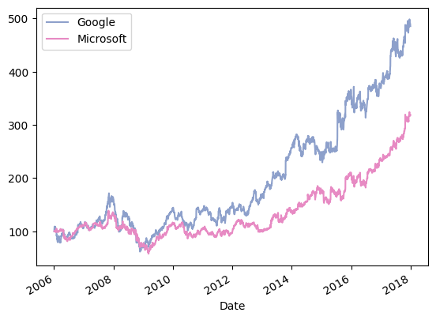
    

- Conclusion:
    - See clearly how google outperforms microsoft over time.


#### 2.1.5. Window functions

- **What are Window functions and how are they useful?**
    - Window functions are used to identify sub periods, calculates sub-metrics of sub-periods.
    - **Rolling - Same size and sliding**
        - Each window has
            - End point: Current timestamp
            - Start point: End point - window size
            - Window size
        - If the current timestamp is the start date of timeseries, then the window is not full.
            - Size of window is less than window size.
            - Window size at that point = 1.
    - **Expanding - Contains all prior values**
        - Each window has
            - End point: Current timestamp
            - Start point: Start date of timeseries
            - Window size: End point - start point


```python
google_stock['High']
```


    Date
    2006-01-03     218.05
    2006-01-04     224.70
    2006-01-05     226.00
    2006-01-06     235.49
    2006-01-09     236.94
                   ...   
    2017-12-22    1071.72
    2017-12-26    1068.86
    2017-12-27    1068.27
    2017-12-28    1064.84
    2017-12-29    1058.05
    Name: High, Length: 3019, dtype: float64


##### Rolling Window


```python
google_stock['High'].rolling(window='90D').mean()
```


    Date
    2006-01-03     218.050000
    2006-01-04     221.375000
    2006-01-05     222.916667
    2006-01-06     226.060000
    2006-01-09     228.236000
                     ...     
    2017-12-22    1031.255000
    2017-12-26    1035.805161
    2017-12-27    1037.451774
    2017-12-28    1038.887742
    2017-12-29    1039.191905
    Name: High, Length: 3019, dtype: float64


- [`pandas.DataFrame.rolling`](https://pandas.pydata.org/docs/reference/api/pandas.DataFrame.rolling.html#pandas.DataFrame.rolling) is a method in pandas used to define a rolling window for time series or sequential data analysis.
    - It enables the calculation of rolling (moving) statistics such as mean, standard deviation, sum, etc., over a specified window size.
    - Params: Takes a required `window` parameter (int, timedelta, str, offset, or BaseIndexer subclass) specifying the number of periods to include in the rolling calculation. Optional parameters include `min_periods`, `center`, `win_type`, etc.
    - Side effects: None — returns a new Rolling object; does not modify original data.
    - Returns: A pandas.core.window.rolling.Rolling object, which can then be used to compute aggregate functions like `.mean()`, `.std()`, `.sum()`, etc.


```python
google_stock['High'].plot(label = 'High', color = palette[2])
google_stock['High'].rolling(window='90D').mean().plot(label = 'Rolling Mean 90D', color = palette[5])
plt.legend()
plt.show()
```

  
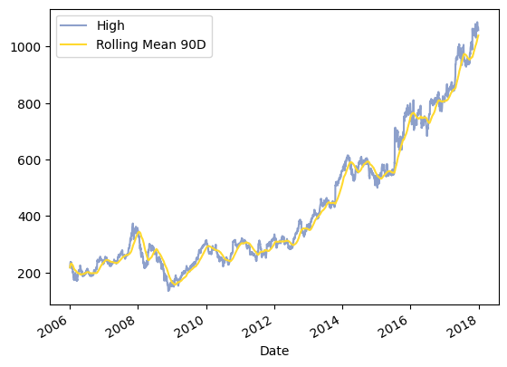
    

- Usecase:
    - Rolling mean plot is a smoother version of the original plot.

##### Expand Window


```python
microsoft_stock['High'].plot(label = 'High', color = palette[3])
microsoft_stock['High'].expanding().mean().plot(label = 'Expanding Mean', color = palette[6])
microsoft_stock['High'].expanding().std().plot(label = 'Expanding Standard Deviation', color = palette[7])
plt.legend()
plt.show()
```


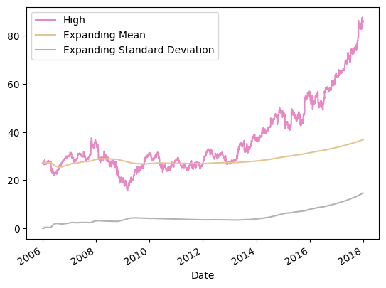
    

#### 2.1.6. OHLC charts [Soon!]

#### 2.1.7. Candlestick charts [Soon!]

#### 2.1.8. Trends, Seasonality, Noise

- These are the components of a time series
    - Trend - Consistent upwards or downwards slope of a time series
    - Seasonality - Clear periodic pattern of a time series(like `sine` funtion)
    - Noise - Outliers or missing values


```python
rcParams['figure.figsize'] = 11, 9
decomposed_google_volume = sm.tsa.seasonal_decompose(google_stock["High"], model = 'additive', period = 360) # The frequency is annual
figure = decomposed_google_volume.plot()
plt.show()
```


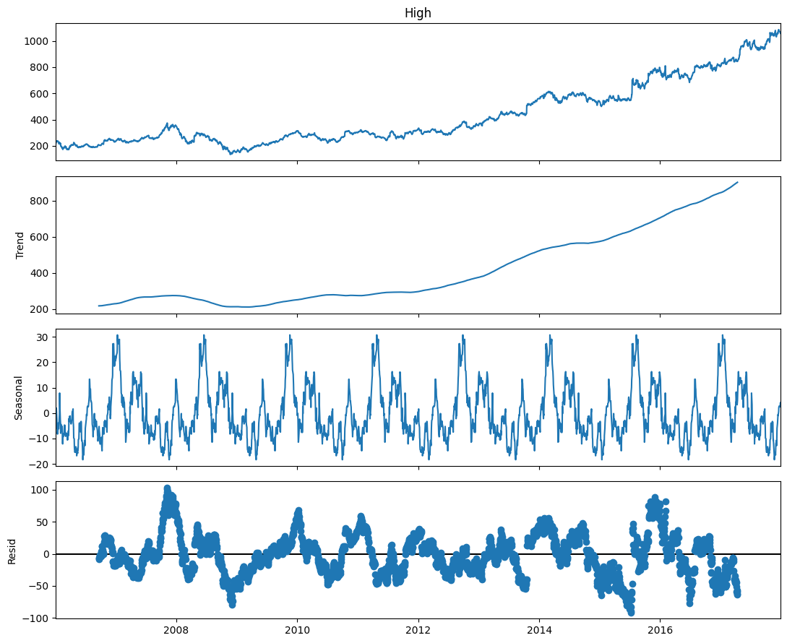
            |

- Trend (Manual caculation)


```python
google_stock["High"].rolling(window='360D').mean().plot(figsize = (20, 4), label = 'Trend', color = palette[2])
```


    <Axes: xlabel='Date'>

    
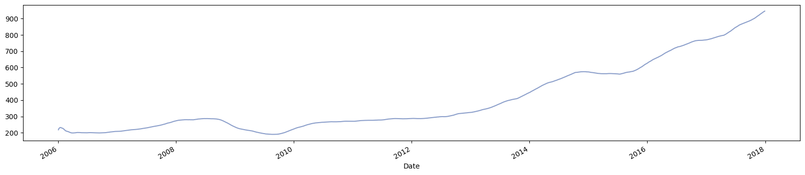
    

```python
# google_stock.drop(['Seasonal_noise_D'], axis = 1)
```

- Seasonal by Quartern (Manual caculation)


```python
google_stock['Seasonal_noise_90D'] = google_stock["High"] - google_stock["High"].rolling(window='90D').mean()
google_stock['Seasonal_noise_90D'].plot(figsize = (20, 4), label = 'Seasonal + Noise', color = palette[2])
```


    <Axes: xlabel='Date'>

    
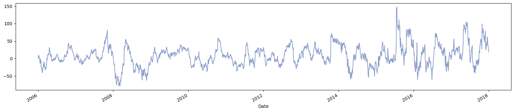
    

```python
seasonal_means = google_stock['Seasonal_noise_90D'].groupby(google_stock.index.quarter).mean()
google_stock['seasonal_90D'] = (google_stock.index.quarter).map(seasonal_means)
google_stock['seasonal_90D'].plot(figsize = (20, 8), label = 'Seasonal', color = palette[2])

```


    <Axes: xlabel='Date'>


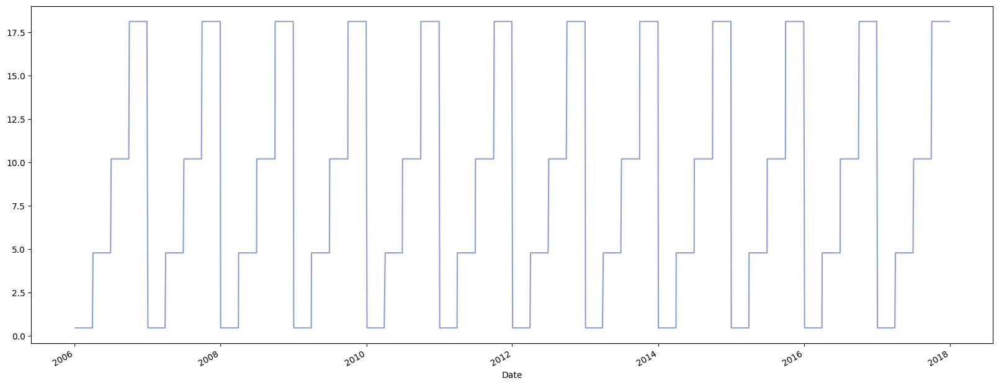
    

- Seasonal by Week (Manual caculation)


```python
google_stock['Seasonal_noise_7D'] = google_stock["High"] - google_stock["High"].rolling(window='7D').mean()
google_stock['Seasonal_noise_7D'].plot(figsize = (20, 4), label = 'Seasonal + Noise', color = palette[2])
```

    <Axes: xlabel='Date'>

  
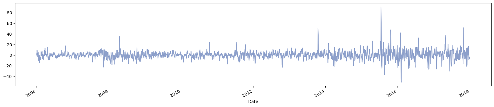
    

```python
seasonal_means = google_stock['Seasonal_noise_7D'].groupby(google_stock.index.isocalendar().week).mean()

google_stock['seasonal_7D'] = (google_stock.index.isocalendar().week).map(seasonal_means)

google_stock['seasonal_7D'].plot(figsize = (20, 8), label = 'Seasonal', color = palette[2])

```


    <Axes: xlabel='Date'>

    
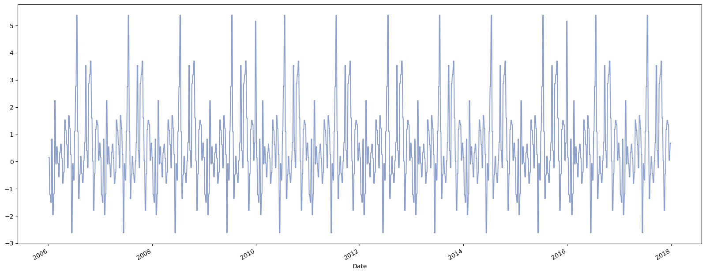
    

- Seasonal by 2 Weeks (Manual caculation)


```python
google_stock['Seasonal_noise_14D'] = google_stock["High"] - google_stock["High"].rolling(window='14D').mean()
google_stock['Seasonal_noise_14D'].plot(figsize = (20, 4), label = 'Seasonal + Noise', color = palette[2])
```


    <Axes: xlabel='Date'>


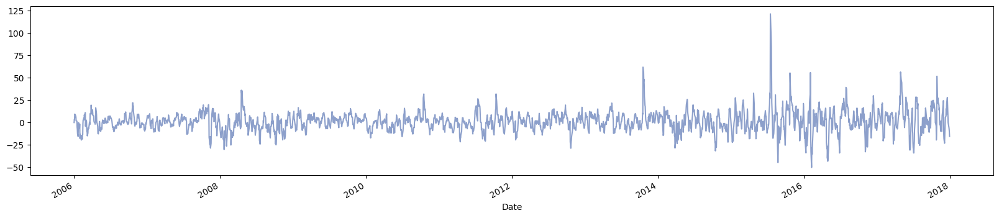
    

```python
seasonal_means = google_stock['Seasonal_noise_14D'].groupby((google_stock.index.isocalendar().week - 1)//2 + 1).mean()

google_stock['seasonal_14D'] = ((google_stock.index.isocalendar().week - 1)//2 + 1).map(seasonal_means)

google_stock['seasonal_14D'].plot(figsize = (20, 8), label = 'Seasonal', color = palette[2])

```


    <Axes: xlabel='Date'>


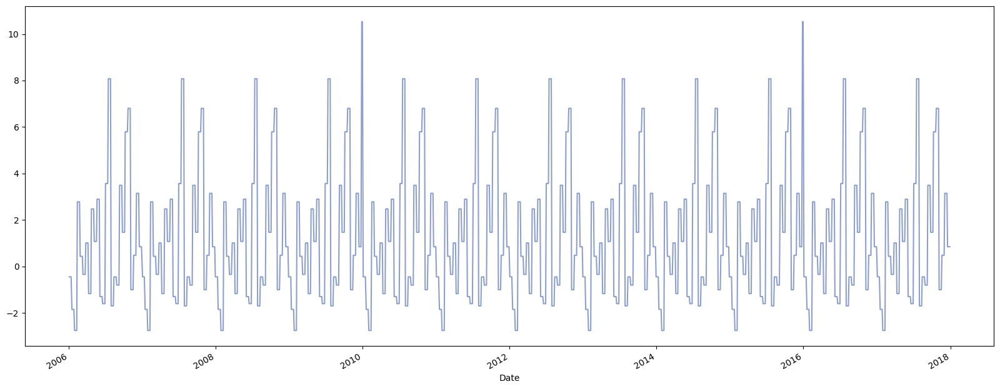
    

- Seasonal by 4 Days (Manual caculation)


```python
google_stock['Seasonal_noise_4D'] = google_stock["High"] - google_stock["High"].rolling(window='4D').mean()
google_stock['Seasonal_noise_4D'].plot(figsize = (20, 4), label = 'Seasonal + Noise', color = palette[2])
```


    <Axes: xlabel='Date'>


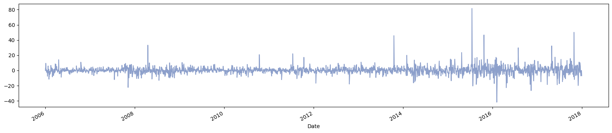
    


```python
seasonal_means = google_stock['Seasonal_noise_4D'].groupby((google_stock.index.dayofyear - 1)//4 + 1).mean()

google_stock['seasonal_4D'] = ((google_stock.index.dayofyear - 1)//4 + 1).map(seasonal_means)

google_stock['seasonal_4D'].plot(figsize = (20, 8), label = 'Seasonal', color = palette[2])

```


    <Axes: xlabel='Date'>


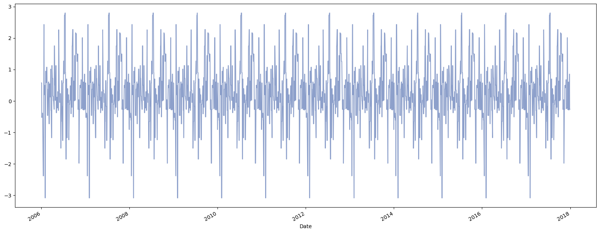
    

- Seasonal by Month (Manual caculation)


```python
google_stock['Seasonal_noise_Month'] = google_stock["High"] - google_stock["High"].rolling(window='30D').mean()
google_stock['Seasonal_noise_Month'].plot(figsize = (20, 4), label = 'Seasonal + Noise', color = palette[2])
```


    <Axes: xlabel='Date'>


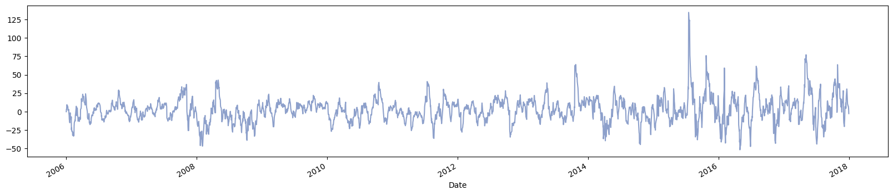
    

```python
seasonal_means = google_stock['Seasonal_noise_Month'].groupby(google_stock.index.month).mean()

google_stock['seasonal_Month'] = (google_stock.index.month).map(seasonal_means)

google_stock['seasonal_Month'].plot(figsize = (20, 8), label = 'Seasonal', color = palette[2])

```


    <Axes: xlabel='Date'>


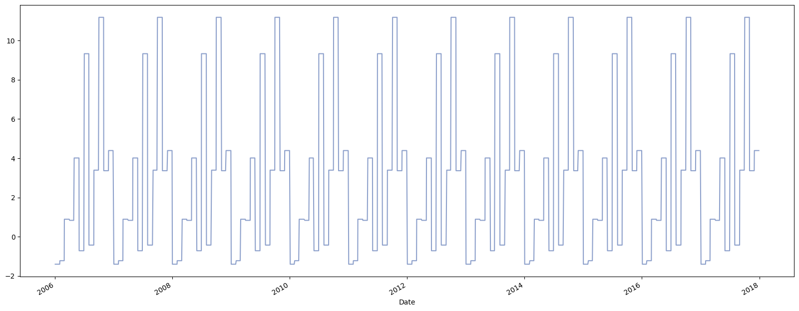
    

- Residual (Manual caculation)


```python
google_stock['residual'] = google_stock['High'] - google_stock["High"].rolling(window='90D').mean() - google_stock['seasonal_90D']

google_stock['residual'].plot(figsize = (20, 8), label = 'Trend', color = palette[2])
```


    <Axes: xlabel='Date'>

    
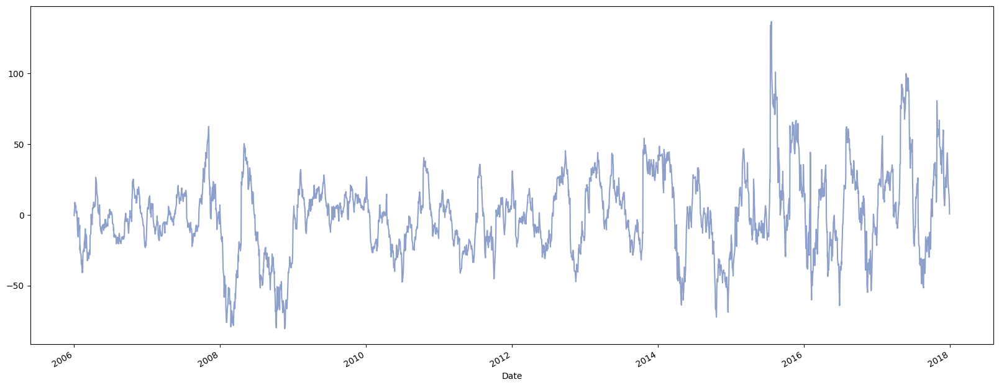
    

| Component    | What it means                                                    | Business translation                                                                                    |
| ------------ | ---------------------------------------------------------------- | ------------------------------------------------------------------------------------------------------- |
| **Observed** | The original stock price data (daily or periodic highs).         | The actual market performance you see.                                                                  |
| **Trend**    | The long-term upward or downward direction in data.              | The general growth or decline in Google’s market value over years.                                      |
| **Seasonal** | The repeating short-term pattern (e.g., monthly or yearly).      | Predictable fluctuations in stock price due to investor behavior, earnings seasons, or macro events.    |
| **Residual** | What’s left after removing trend and seasonality (random noise). | Irregular changes caused by unexpected events like news shocks, product launches, or regulatory issues. |

| Key finding | Business interpretation | Implication |
| --- | --- | --- | 
| **Upward Trend** | Over the years (2006–2018), Google’s stock consistently increased. This shows **sustained business growth** and rising investor confidence. | The company’s long-term fundamentals are positive; suitable for long-term investors. |
| **Uniform Seasonality** | The stock exhibits **repetitive fluctuations** — possibly due to annual cycles like **quarterly earnings reports, advertising seasons, or tech launches**. This means certain times of the year are predictably stronger. | Trading strategies or marketing campaigns can be aligned with recurring cycles. |
| **Residual / Noise** | Irregular spikes or drops that don’t follow the pattern — could represent **market reactions to news, product events, or global shocks**. These are **non-systematic** and hard to forecast. | Helps analysts separate real performance from short-term volatility or data errors. |

- [`sm.tsa.seasonal_decompose`](https://www.statsmodels.org/stable/release/version0.6.html#seasonal-decomposition)is a function from the statsmodels library used to decompose time series data into trend, seasonal, and residual components.
    - It applies classical seasonal decomposition via moving averages, enabling analysis of recurring patterns and underlying trends in time-based datasets.
    - Params:
        - x: array_like – Time series data (1D or 2D with series in columns)
        - `model`: {"additive", "multiplicative"} – Type of decomposition; default is "additive"
        - filt: array_like, optional – Filter coefficients for trend extraction
        - `period`: int, optional – The number of observations per seasonal cycle (replaces freq)
        - `freq`: int, optional – Deprecated; use period instead (e.g., 12 for monthly, 360 for daily annual cycles)
        - two_sided: bool – Whether the moving average is centered (default True)
        - extrapolate_trend: int or "freq" – Number of observations to extrapolate trend for at boundaries
    - Side effects: None – the function is purely analytical
    - Returns: A DecomposeResult object with attributes .trend, .seasonal, .resid, and .observed
    - Plotting: The result has a .plot() method that visualizes all components
        - Note: The freq parameter is deprecated in newer versions of statsmodels; period is preferred.

#### 2.1.9. White noise

- Note: Don't know the reason why "White noise" existing in this report.

- White noise includes:
    - Constant mean
    - Constant variance
    - Zero auto-correlation at all lags


```python
# Plotting white noise
rcParams['figure.figsize'] = 16, 6
white_noise = np.random.normal(loc=0, scale=1, size=1000)
# loc = mean of the distribution
# scale = standard deviation (not variance, despite comment)
# size = number of random samples to generate
plt.plot(white_noise)
```


    [<matplotlib.lines.Line2D at 0x2415574ae90>]


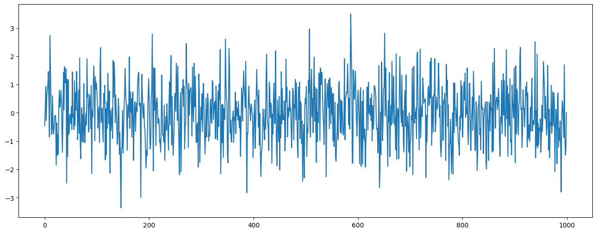
    

- See random ups and downs without trend or pattern.


```python
# Plotting autocorrelation of white noise
plot_acf(white_noise,lags=20)
plt.show()
```

    
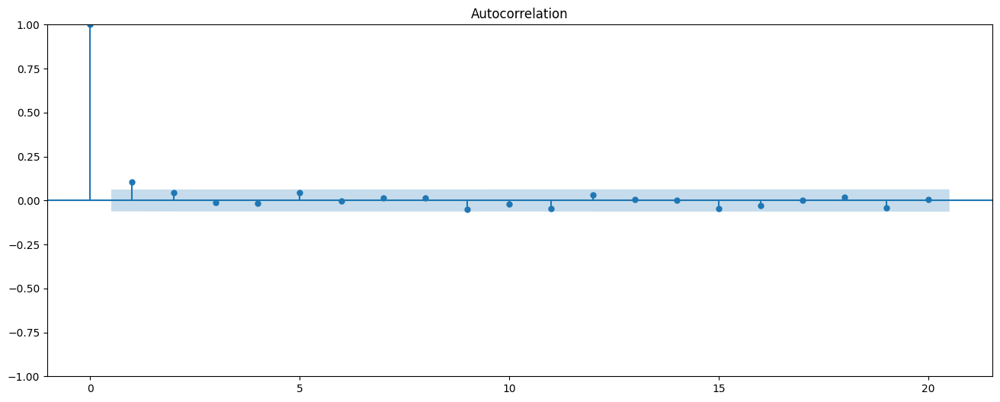
    

- If compute ACF (autocorrelation function), all lags ≈ 0 → confirms it’s white noise.

- Business term:
    - White noise = "natural randomness".
    - If the forecast errors look like white noise, the model is strong.
    - If not — there’s still a pattern left to learn.

| Aspect | White Noise |
| --- | --- |
| Pattern | None (completely random) |
| Predictability | None |
| Mean & variance | Constant |
| Ideal residual | Yes, for good forecasting models |
| Business meaning | What’s left after removing all explainable structure (trend + seasonality) |


| Use case | How white noise helps | Business interpretation |
| --- | --- | --- |
| **Model checking (ARIMA, forecasting)** | After fitting a model, if residuals are white noise → your model has captured all real patterns | Good: model explains everything that’s explainable |
| **Anomaly detection** | White noise defines “normal randomness” → any large deviation from it might be an outlier | Detect sales spikes, fraud, system errors |
| **Risk modeling (finance)** | Returns with white noise imply efficient market — no predictable profit opportunities | Used to test market efficiency |
| **Process control** | In manufacturing or operations, output should behave like white noise if process is stable | Any pattern → problem in production |


#### 2.1.10. Random Walk

A random walk is a mathematical object, known as a stochastic or random process, that describes a path that consists of a succession of random steps on some mathematical space such as the integers.


**Basic Random Walk**

$P_t = P_{t-1} + \varepsilon_t$

* $(P_t)$: price (or value) at time *t*
* $(\varepsilon_t)$: random noise (unexpected shock)

**Random Walk with Drift**

$P_t = \mu + P_{t-1} + \varepsilon_t$ 

* $\mu$: small constant drift (average upward or downward movement)
* Example: a stock with a long-term upward trend.

**Basic Random Walk**

$[
P_t = P_{t-1} + \varepsilon_t
]$

* $(P_t)$: price (or value) at time *t*
* $(\varepsilon_t)$: random noise (unexpected shock)

**Random Walk with Drift**

$[
P_t = \mu + P_{t-1} + \varepsilon_t
]$ 

* $(\mu)$: small constant drift (average upward or downward movement)
* Example: a stock with a long-term upward trend.

| Use Case | Explanation | Why Random Walk Important |
| --- | --- | --- |
| **Stock price forecasting** | Stock prices are often modeled as random walks. | Because if prices follow a random walk, **past prices can’t predict future ones** → markets are “efficient.” |
| **Stationarity testing (ADF Test)** | To decide whether a time series is stationary or not. | A **non-stationary** series usually behaves like a random walk. |
| **Simulation of future values** | Monte Carlo simulations for price paths. | Random walk is used to **generate many possible future scenarios**. |
| **Model testing** | Used to compare ARIMA or LSTM results. | You can test if your model performs better than a random walk baseline. |


Regression test for random walk

$P_t = \alpha + \beta P_{t-1} + \epsilon_t$

Equivalent to $P_t - P_{t-1} = \alpha + \beta P_{t-1} + \epsilon_t$

Test:

$H_0: \beta = 1$ 
(The series has a unit root → Random walk (non-stationary))<br/>
$H_1: \beta < 1$
(This is not a random walk)

Dickey-Fuller Test:

$H_0: \beta = 0$
(This is a random walk)<br/>
$H_1: \beta < 0$
(This is not a random walk)

**Augmented Dickey-Fuller test**

An augmented Dickey–Fuller test (ADF) tests the null hypothesis that a unit root is present in a time series sample. It is basically Dickey-Fuller test with more lagged changes on RHS.
- to augment /ɔːɡˈment/: to increase the size or value of something by adding something to it, to make something larger or fuller by adding something to it
    - VN: tăng cường
    - Ex: He augmented his income by taking a second job

- **Vấn đề mà Dickey-Fuller Test muốn giải quyết**
    - Khi bạn làm việc với dữ liệu chuỗi thời gian (time series), ví dụ:
        - Giá cổ phiếu
        - Tỷ giá
        - Doanh số bán hàng

    → Bạn cần biết: **Chuỗi đó có “tính dừng” hay không?**

- **Tính dừng (Stationarity) là gì?**

    | Đặc điểm | Chuỗi có tính dừng | Chuỗi không có tính dừng (như Random Walk) |
    | --- | --- | --- |
    | **Mean (trung bình)**     | Không thay đổi theo thời gian | Thay đổi dần theo thời gian                |
    | **Variance (phương sai)** | Ổn định                       | Tăng theo thời gian                        |
    | **Dễ dự đoán?**           | Có thể dự đoán phần nào       | Gần như không thể dự đoán                  |

    <br/>

    > Nếu chuỗi **không dừng**, các mô hình thống kê (như ARIMA, Regression, Machine Learning) sẽ **dự đoán sai lệch hoặc kém chính xác**.

- **Dickey-Fuller Test kiểm tra điều gì**

    Mục tiêu của **Dickey-Fuller Test**:

    > Kiểm tra xem chuỗi có phải là **Random Walk (không dừng)** hay **Stationary (dừng)**.

- **Công thức cơ bản**

    Giả sử chuỗi dữ liệu:
    $P_t = \alpha + \beta P_{t-1} + \varepsilon_t$

    Ta **trừ $P_{t-1}$** hai vế →

    $P_t - P_{t-1} = \alpha + (\beta - 1)P_{t-1} + \varepsilon_t$<br/>
    $\Delta P_t = \alpha + \gamma P_{t-1} + \varepsilon_t$<br/>
    trong đó $\gamma = (\beta - 1)$

- **Giả thuyết kiểm định**

    | Ký hiệu             | Giả thuyết         | Ý nghĩa                               |
    | ------------------- | ------------------ | ------------------------------------- |
    | $H_0$: $\gamma = 0$ | Có unit root       | Chuỗi là **random walk** (không dừng) |
    | $H_1$: $\gamma < 0$ | Không có unit root | Chuỗi **stationary** (dừng)           |

- **Cách đọc kết quả**

    | Kết quả kiểm định  | Kết luận           | Giải thích đơn giản                            |
    | ------------------ | ------------------ | ---------------------------------------------- |
    | **p-value < 0.05** | Bác bỏ $H_0$       | Chuỗi **có tính dừng**, KHÔNG phải random walk |
    | **p-value ≥ 0.05** | Không bác bỏ $H_0$ | Chuỗi **không dừng**, hành xử như random walk  |

- **Ví dụ trực quan**

    | Trường hợp                                                              | Diễn giải                                     |
    | ----------------------------------------------------------------------- | --------------------------------------------- |
    | Nếu bạn test giá cổ phiếu AAPL và p-value = 0.8                         | → Giá AAPL biến động ngẫu nhiên (random walk) |
    | Nếu bạn test phần **thay đổi giá hàng ngày (ΔPrice)** và p-value = 0.01 | → Chuỗi ΔPrice **đã dừng** (stationary)       |

- **Mở rộng: Augmented Dickey-Fuller (ADF) Test**

    Dickey-Fuller cơ bản giả định chỉ có **1 độ trễ (lag)**.
    Nhưng trong thực tế, dữ liệu có thể có nhiều độ trễ → **ADF test** (Augmented Dickey-Fuller) sẽ thêm các độ trễ này để kiểm tra chính xác hơn.

    $\Delta P_t = \alpha + \gamma P_{t-1} + \sum_{i=1}^{p}\delta_i \Delta P_{t-i} + \varepsilon_t$


```python
# Augmented Dicky-Fuller (ADF) Test om Volume of Google Stock
ggs_adf = adfuller(google_stock['Volume'])
print(f"p-value of Google: {float(ggs_adf[1]):.10f}")
print("p-value of Google: {}".format(float(ggs_adf[1])))

mcrs_adf = adfuller(microsoft_stock['Volume'])
print(f"p-value of Microsoft: {float(mcrs_adf[1]):.10f}")
print("p-value of Microsoft: {}".format(float(mcrs_adf[1])))
```

    p-value of Google: 0.0000006511
    p-value of Google: 6.510719605768891e-07
    p-value of Microsoft: 0.0003201525
    p-value of Microsoft: 0.0003201525277652051
    

- Conclusion:
    - Microsoft has p-value 0.0003201525 which is less than 0.05, null hypothesis is rejected and this is not a random walk.
    - Google has p-value 0.0000006510 which is more than 0.05, null hypothesis is rejected and this is not a random walk.

- `adfuller` is a Python function from the `statsmodels` library used to perform the Augmented Dickey-Fuller (ADF) test for stationarity in time series data.
    - It tests whether a unit root is present in a time series, helping determine if the series is stationary or requires differencing.
    - Params:
            - x: array-like, 1-dimensional – the time series to test
            - maxlag: int, optional – maximum number of lags to include in the test regression
            - autolag: {'AIC', 'BIC', 't-stat', None} – method to automatically select lag length
            - regression: {'c', 'ct', 'ctt', 'nc'} – type of regression: constant, trend, etc.
            - store: bool – if True, returns additional results
            - regresults: bool – if True, returns regression results
    - Returns:
        - tuple containing:
            - Test Statistic
            - p-value
            - Number of lags used
            - Number of observations used
            - Critical Values (at 1%, 5%, 10%)
            - Optional: icbest, resstore (if autolag or store is enabled)


```python
seed(42)
rcParams['figure.figsize'] = 16, 6
random_walk = normal(loc=0, scale=0.01, size=1000) # Random array
plt.plot(random_walk)
plt.show()
```


    
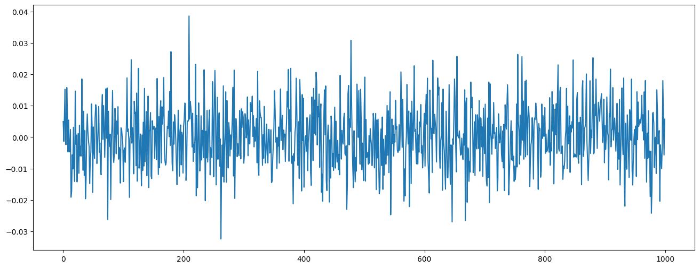
    


```python
fig = ff.create_distplot([random_walk],['Random Walk'],bin_size=0.001)
iplot(fig, filename='Basic Distplot')
```


- `create_distplot` is a function from the Plotly library used to generate distribution plots.
    - It visualizes the distribution of a dataset by plotting histograms, kernel density estimates (KDE), and rug plots in a single figure, making it easier to analyze data spread and shape.
    - Params:
        - data: List of arrays, each representing a dataset (e.g., [random_walk]).
        - group_labels: List of strings labeling each dataset (e.g., ['Random Walk']).
        - bin_size: Optional float controlling histogram bin width (set to 0.001 here).
    - Side effects: Generates an interactive Plotly figure object.
    - Returns: A Plotly Figure object containing the distribution plot, which can be rendered using iplot.

#### 2.1.11. Stationarity

- A stationary time series is one whose statistical properties such as mean, variance, autocorrelation, etc. are all constant over time.
    - Strong stationarity: is a stochastic process whose unconditional joint probability distribution does not change when shifted in time. Consequently, parameters such as mean and variance also do not change over time.
    - Weak stationarity: is a process where mean, variance, autocorrelation are constant throughout the time
- Stationarity is important as non-stationary series that depend on time have too many parameters to account for when modelling the time series. `diff()` method can easily convert a non-stationary series to a stationary series.

We will try to decompose seasonal component of the above decomposed time series.


```python
# The original non-stationary plot
decomposed_google_volume.trend.plot()
```


    <Axes: xlabel='Date'>

    
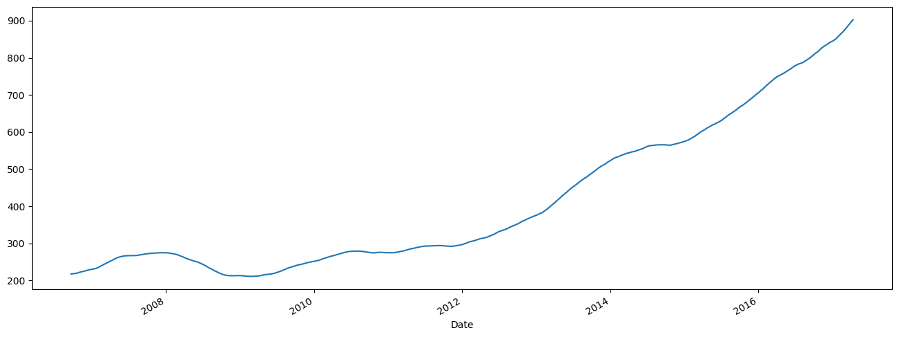
    

```python
# Convert A non-stationary series to the new stationary plot <> The residual
decomposed_google_volume.trend.diff().plot()
```

    <Axes: xlabel='Date'>


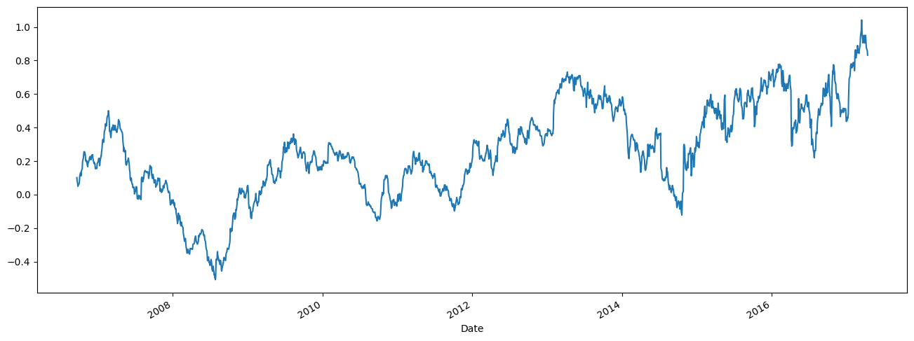
    


- `diff` is a method used to compute the first discrete difference of elements in a time series or sequence.
    - It is commonly used in time series analysis to transform non-stationary data into stationary data by subtracting the previous value from the current value, helping stabilize the mean and remove trends.
    - Basic information:
        - Type: Method of pandas Series/DataFrame
        - Purpose: Compute the first discrete difference (i.e., x[i] - x[i-1])
        - Returns: A new Series or DataFrame of the same size with NaN in the first position
        - Parameters: periods=1 by default (can be adjusted for higher-order differencing)
        - Side effects: None — it returns a transformed copy


```python
decomposed_google_volume.resid.plot()
```

    <Axes: xlabel='Date'>


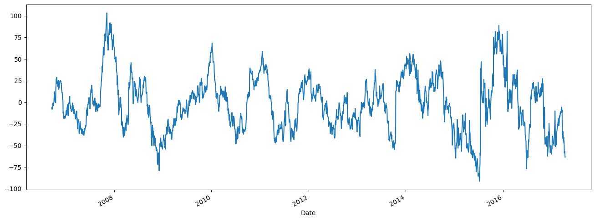
    


### 2.2 Humidity Dataset


```python
humidity.info()
```

    <class 'pandas.core.frame.DataFrame'>
    DatetimeIndex: 45253 entries, 2012-10-01 12:00:00 to 2017-11-30 00:00:00
    Data columns (total 36 columns):
     #   Column             Non-Null Count  Dtype  
    ---  ------             --------------  -----  
     0   Vancouver          43427 non-null  float64
     1   Portland           44804 non-null  float64
     2   San Francisco      44311 non-null  float64
     3   Seattle            44964 non-null  float64
     4   Los Angeles        45101 non-null  float64
     5   San Diego          44909 non-null  float64
     6   Las Vegas          44411 non-null  float64
     7   Phoenix            43945 non-null  float64
     8   Albuquerque        44543 non-null  float64
     9   Denver             43445 non-null  float64
     10  San Antonio        44689 non-null  float64
     11  Dallas             44934 non-null  float64
     12  Houston            45132 non-null  float64
     13  Kansas City        44741 non-null  float64
     14  Minneapolis        44743 non-null  float64
     15  Saint Louis        43964 non-null  float64
     16  Chicago            44144 non-null  float64
     17  Nashville          44686 non-null  float64
     18  Indianapolis       44558 non-null  float64
     19  Atlanta            44831 non-null  float64
     20  Detroit            44391 non-null  float64
     21  Jacksonville       45044 non-null  float64
     22  Charlotte          44664 non-null  float64
     23  Miami              44166 non-null  float64
     24  Pittsburgh         44731 non-null  float64
     25  Toronto            44525 non-null  float64
     26  Philadelphia       44629 non-null  float64
     27  New York           43629 non-null  float64
     28  Montreal           43557 non-null  float64
     29  Boston             44804 non-null  float64
     30  Beersheba          44394 non-null  float64
     31  Tel Aviv District  44140 non-null  float64
     32  Eilat              44283 non-null  float64
     33  Haifa              44435 non-null  float64
     34  Nahariyya          44436 non-null  float64
     35  Jerusalem          44347 non-null  float64
    dtypes: float64(36)
    memory usage: 12.8 MB
    

- Dataset of Humidity includes:
    - Feature list:
        - 36 columns: 30 US and Canadian Cities, as well as 6 Israeli cities
        - DatatimeIndex
            - Data range: 2012-10-01 12:00:00 to 2017-11-30 00:00:00
            - Frequency: Hourly
    - Number of record: 45253
- About missing data in specific cities:
    - Found missing data in specific cities in some hours.


```python
pd.date_range(start='2012-10-01 12:00:00', end='2017-11-30 00:00:00', freq='h')
```


    DatetimeIndex(['2012-10-01 12:00:00', '2012-10-01 13:00:00',
                   '2012-10-01 14:00:00', '2012-10-01 15:00:00',
                   '2012-10-01 16:00:00', '2012-10-01 17:00:00',
                   '2012-10-01 18:00:00', '2012-10-01 19:00:00',
                   '2012-10-01 20:00:00', '2012-10-01 21:00:00',
                   ...
                   '2017-11-29 15:00:00', '2017-11-29 16:00:00',
                   '2017-11-29 17:00:00', '2017-11-29 18:00:00',
                   '2017-11-29 19:00:00', '2017-11-29 20:00:00',
                   '2017-11-29 21:00:00', '2017-11-29 22:00:00',
                   '2017-11-29 23:00:00', '2017-11-30 00:00:00'],
                  dtype='datetime64[ns]', length=45253, freq='h')


- About time range: 
    - Haven't found any missing datatimeindex.


```python
humidity.describe()
```


<div>
<style scoped>
    .dataframe tbody tr th:only-of-type {
        vertical-align: middle;
    }

    .dataframe tbody tr th {
        vertical-align: top;
    }

    .dataframe thead th {
        text-align: right;
    }
</style>
<table border="1" class="dataframe">
  <thead>
    <tr style="text-align: right;">
      <th></th>
      <th>Vancouver</th>
      <th>Portland</th>
      <th>San Francisco</th>
      <th>Seattle</th>
      <th>Los Angeles</th>
      <th>San Diego</th>
      <th>Las Vegas</th>
      <th>Phoenix</th>
      <th>Albuquerque</th>
      <th>Denver</th>
      <th>...</th>
      <th>Philadelphia</th>
      <th>New York</th>
      <th>Montreal</th>
      <th>Boston</th>
      <th>Beersheba</th>
      <th>Tel Aviv District</th>
      <th>Eilat</th>
      <th>Haifa</th>
      <th>Nahariyya</th>
      <th>Jerusalem</th>
    </tr>
  </thead>
  <tbody>
    <tr>
      <th>count</th>
      <td>43427.000000</td>
      <td>44804.000000</td>
      <td>44311.000000</td>
      <td>44964.000000</td>
      <td>45101.000000</td>
      <td>44909.000000</td>
      <td>44411.000000</td>
      <td>43945.000000</td>
      <td>44543.000000</td>
      <td>43445.000000</td>
      <td>...</td>
      <td>44629.000000</td>
      <td>43629.000000</td>
      <td>43557.000000</td>
      <td>44804.000000</td>
      <td>44394.000000</td>
      <td>44140.000000</td>
      <td>44283.000000</td>
      <td>44435.000000</td>
      <td>44436.000000</td>
      <td>44347.000000</td>
    </tr>
    <tr>
      <th>mean</th>
      <td>81.895480</td>
      <td>74.697616</td>
      <td>76.875042</td>
      <td>77.159038</td>
      <td>62.773841</td>
      <td>67.784809</td>
      <td>31.937831</td>
      <td>37.484424</td>
      <td>45.186157</td>
      <td>53.022557</td>
      <td>...</td>
      <td>68.017769</td>
      <td>66.642417</td>
      <td>71.861538</td>
      <td>77.375301</td>
      <td>70.604857</td>
      <td>66.861509</td>
      <td>53.155184</td>
      <td>79.800383</td>
      <td>78.606760</td>
      <td>68.732293</td>
    </tr>
    <tr>
      <th>std</th>
      <td>14.522221</td>
      <td>19.042656</td>
      <td>17.396016</td>
      <td>18.147464</td>
      <td>21.818042</td>
      <td>19.419307</td>
      <td>20.041855</td>
      <td>21.662728</td>
      <td>23.336546</td>
      <td>23.905392</td>
      <td>...</td>
      <td>18.790524</td>
      <td>19.874727</td>
      <td>16.825027</td>
      <td>18.750190</td>
      <td>21.321606</td>
      <td>16.464177</td>
      <td>27.305008</td>
      <td>23.051692</td>
      <td>23.682244</td>
      <td>19.273881</td>
    </tr>
    <tr>
      <th>min</th>
      <td>12.000000</td>
      <td>10.000000</td>
      <td>6.000000</td>
      <td>13.000000</td>
      <td>5.000000</td>
      <td>5.000000</td>
      <td>5.000000</td>
      <td>5.000000</td>
      <td>5.000000</td>
      <td>5.000000</td>
      <td>...</td>
      <td>10.000000</td>
      <td>10.000000</td>
      <td>7.000000</td>
      <td>11.000000</td>
      <td>5.000000</td>
      <td>5.000000</td>
      <td>5.000000</td>
      <td>5.000000</td>
      <td>5.000000</td>
      <td>5.000000</td>
    </tr>
    <tr>
      <th>25%</th>
      <td>73.000000</td>
      <td>63.000000</td>
      <td>68.000000</td>
      <td>66.000000</td>
      <td>48.000000</td>
      <td>56.000000</td>
      <td>16.000000</td>
      <td>21.000000</td>
      <td>26.000000</td>
      <td>33.000000</td>
      <td>...</td>
      <td>54.000000</td>
      <td>51.000000</td>
      <td>60.000000</td>
      <td>65.000000</td>
      <td>54.000000</td>
      <td>58.000000</td>
      <td>31.000000</td>
      <td>63.000000</td>
      <td>61.000000</td>
      <td>56.000000</td>
    </tr>
    <tr>
      <th>50%</th>
      <td>86.000000</td>
      <td>80.000000</td>
      <td>81.000000</td>
      <td>81.000000</td>
      <td>66.000000</td>
      <td>71.000000</td>
      <td>27.000000</td>
      <td>32.000000</td>
      <td>42.000000</td>
      <td>52.000000</td>
      <td>...</td>
      <td>68.000000</td>
      <td>68.000000</td>
      <td>74.000000</td>
      <td>81.000000</td>
      <td>77.000000</td>
      <td>69.000000</td>
      <td>48.000000</td>
      <td>89.000000</td>
      <td>87.000000</td>
      <td>70.000000</td>
    </tr>
    <tr>
      <th>75%</th>
      <td>93.000000</td>
      <td>90.000000</td>
      <td>89.000000</td>
      <td>93.000000</td>
      <td>81.000000</td>
      <td>82.000000</td>
      <td>43.000000</td>
      <td>50.000000</td>
      <td>63.000000</td>
      <td>73.000000</td>
      <td>...</td>
      <td>84.000000</td>
      <td>83.000000</td>
      <td>86.000000</td>
      <td>93.000000</td>
      <td>88.000000</td>
      <td>78.000000</td>
      <td>75.000000</td>
      <td>100.000000</td>
      <td>100.000000</td>
      <td>83.000000</td>
    </tr>
    <tr>
      <th>max</th>
      <td>100.000000</td>
      <td>100.000000</td>
      <td>100.000000</td>
      <td>100.000000</td>
      <td>100.000000</td>
      <td>100.000000</td>
      <td>100.000000</td>
      <td>100.000000</td>
      <td>100.000000</td>
      <td>100.000000</td>
      <td>...</td>
      <td>100.000000</td>
      <td>100.000000</td>
      <td>100.000000</td>
      <td>100.000000</td>
      <td>100.000000</td>
      <td>100.000000</td>
      <td>100.000000</td>
      <td>100.000000</td>
      <td>100.000000</td>
      <td>100.000000</td>
    </tr>
  </tbody>
</table>
<p>8 rows × 36 columns</p>
</div>


- Max of humidity is 100.
- Range of humidity is 0 to 100.
- About the variability between cities:
    - Exist the difference between cities.


```python
humidity.isnull().sum()
```


    Vancouver            1826
    Portland              449
    San Francisco         942
    Seattle               289
    Los Angeles           152
    San Diego             344
    Las Vegas             842
    Phoenix              1308
    Albuquerque           710
    Denver               1808
    San Antonio           564
    Dallas                319
    Houston               121
    Kansas City           512
    Minneapolis           510
    Saint Louis          1289
    Chicago              1109
    Nashville             567
    Indianapolis          695
    Atlanta               422
    Detroit               862
    Jacksonville          209
    Charlotte             589
    Miami                1087
    Pittsburgh            522
    Toronto               728
    Philadelphia          624
    New York             1624
    Montreal             1696
    Boston                449
    Beersheba             859
    Tel Aviv District    1113
    Eilat                 970
    Haifa                 818
    Nahariyya             817
    Jerusalem             906
    dtype: int64


```python
humidity.duplicated().sum()
```


    np.int64(678)


```python
humidity.shape
```


    (45253, 36)


```python
humidity = humidity.drop_duplicates()
```


```python
humidity.shape
```


    (44575, 36)


```python
humidity = humidity.fillna(method='ffill')
humidity.tail()
```

    C:\Users\yenpth8\AppData\Local\Temp\ipykernel_14780\901494674.py:1: FutureWarning:
    
    DataFrame.fillna with 'method' is deprecated and will raise in a future version. Use obj.ffill() or obj.bfill() instead.
    
    


<div>
<style scoped>
    .dataframe tbody tr th:only-of-type {
        vertical-align: middle;
    }

    .dataframe tbody tr th {
        vertical-align: top;
    }

    .dataframe thead th {
        text-align: right;
    }
</style>
<table border="1" class="dataframe">
  <thead>
    <tr style="text-align: right;">
      <th></th>
      <th>Vancouver</th>
      <th>Portland</th>
      <th>San Francisco</th>
      <th>Seattle</th>
      <th>Los Angeles</th>
      <th>San Diego</th>
      <th>Las Vegas</th>
      <th>Phoenix</th>
      <th>Albuquerque</th>
      <th>Denver</th>
      <th>...</th>
      <th>Philadelphia</th>
      <th>New York</th>
      <th>Montreal</th>
      <th>Boston</th>
      <th>Beersheba</th>
      <th>Tel Aviv District</th>
      <th>Eilat</th>
      <th>Haifa</th>
      <th>Nahariyya</th>
      <th>Jerusalem</th>
    </tr>
    <tr>
      <th>datetime</th>
      <th></th>
      <th></th>
      <th></th>
      <th></th>
      <th></th>
      <th></th>
      <th></th>
      <th></th>
      <th></th>
      <th></th>
      <th></th>
      <th></th>
      <th></th>
      <th></th>
      <th></th>
      <th></th>
      <th></th>
      <th></th>
      <th></th>
      <th></th>
      <th></th>
    </tr>
  </thead>
  <tbody>
    <tr>
      <th>2017-11-29 20:00:00</th>
      <td>87.0</td>
      <td>81.0</td>
      <td>22.0</td>
      <td>93.0</td>
      <td>24.0</td>
      <td>72.0</td>
      <td>18.0</td>
      <td>68.0</td>
      <td>37.0</td>
      <td>18.0</td>
      <td>...</td>
      <td>27.0</td>
      <td>58.0</td>
      <td>64.0</td>
      <td>37.0</td>
      <td>57.0</td>
      <td>60.0</td>
      <td>100.0</td>
      <td>96.0</td>
      <td>96.0</td>
      <td>60.0</td>
    </tr>
    <tr>
      <th>2017-11-29 21:00:00</th>
      <td>87.0</td>
      <td>71.0</td>
      <td>22.0</td>
      <td>87.0</td>
      <td>21.0</td>
      <td>72.0</td>
      <td>18.0</td>
      <td>73.0</td>
      <td>34.0</td>
      <td>12.0</td>
      <td>...</td>
      <td>29.0</td>
      <td>58.0</td>
      <td>59.0</td>
      <td>74.0</td>
      <td>57.0</td>
      <td>60.0</td>
      <td>100.0</td>
      <td>96.0</td>
      <td>96.0</td>
      <td>60.0</td>
    </tr>
    <tr>
      <th>2017-11-29 22:00:00</th>
      <td>87.0</td>
      <td>71.0</td>
      <td>22.0</td>
      <td>93.0</td>
      <td>23.0</td>
      <td>68.0</td>
      <td>17.0</td>
      <td>60.0</td>
      <td>32.0</td>
      <td>15.0</td>
      <td>...</td>
      <td>31.0</td>
      <td>58.0</td>
      <td>66.0</td>
      <td>74.0</td>
      <td>57.0</td>
      <td>60.0</td>
      <td>100.0</td>
      <td>96.0</td>
      <td>96.0</td>
      <td>60.0</td>
    </tr>
    <tr>
      <th>2017-11-29 23:00:00</th>
      <td>87.0</td>
      <td>71.0</td>
      <td>22.0</td>
      <td>87.0</td>
      <td>14.0</td>
      <td>63.0</td>
      <td>17.0</td>
      <td>33.0</td>
      <td>30.0</td>
      <td>28.0</td>
      <td>...</td>
      <td>26.0</td>
      <td>58.0</td>
      <td>58.0</td>
      <td>56.0</td>
      <td>57.0</td>
      <td>60.0</td>
      <td>100.0</td>
      <td>96.0</td>
      <td>96.0</td>
      <td>60.0</td>
    </tr>
    <tr>
      <th>2017-11-30 00:00:00</th>
      <td>87.0</td>
      <td>76.0</td>
      <td>22.0</td>
      <td>75.0</td>
      <td>56.0</td>
      <td>72.0</td>
      <td>17.0</td>
      <td>23.0</td>
      <td>34.0</td>
      <td>31.0</td>
      <td>...</td>
      <td>32.0</td>
      <td>58.0</td>
      <td>58.0</td>
      <td>56.0</td>
      <td>57.0</td>
      <td>60.0</td>
      <td>100.0</td>
      <td>96.0</td>
      <td>96.0</td>
      <td>60.0</td>
    </tr>
  </tbody>
</table>
<p>5 rows × 36 columns</p>
</div>


```python
humidity = humidity.fillna(method='bfill')

```
    

- Google stocks data doesn't have any missing values but humidity data does have its fair share of missing values. It is cleaned using fillna() method with ffill parameter which propagates last valid observation to fill gaps.

#### 2.2.1. The relationship of Observations at different time lags

- The relationship of Observations at different time lags, having 3 concepts:
    - AutoCorrelation
    - Partial Autocorrelation
    - Inverse Autocorrelation

| Thuộc tính           | ACF                    | PACF                                      | Inverse ACF                            |
| -------------------- | ---------------------- | ----------------------------------------- | -------------------------------------- |
| Khái niệm            | Autocorrelation đo lường **mức độ tương quan tuyến tính** giữa chuỗi ( Y_t ) và chính nó tại các độ trễ ( Y_{t-k} ).   | PACF đo **tương quan giữa ( Y_t ) và ( Y_{t-k} )** **sau khi loại bỏ ảnh hưởng trung gian** của các lag nhỏ hơn (1 đến k−1). | Inverse ACF là **hệ số tương quan còn lại sau khi đã lọc hết cấu trúc AR và MA** trong chuỗi. Nói cách khác, nó đo **độ “ngẫu nhiên” còn lại** trong phần dư (residual). |
| Mối quan hệ đo lường | Tương quan tổng        | Tương quan trực tiếp (loại bỏ trung gian) | Tương quan còn sót sau khi mô hình hóa |
| Dùng để xác định     | Bậc **MA(q)**          | Bậc **AR(p)**                             | Kiểm tra model có còn autocorrelation  |
| Giai đoạn sử dụng    | Trước khi modeling     | Trước khi modeling                        | Sau khi modeling                       |
| Biểu đồ kỳ vọng      | Giảm dần hoặc dao động | Cắt đột ngột                              | Gần như 0 (nếu model tốt)              |

##### AutoCorrelation

- Careful note:
    - Autocorrelation can't present if having any null data/missing data in dataset.


```python
# Autocorrelation of humidity of San Diego
plot_acf(humidity['San Diego'], lags=25, title = 'San Diego', color = palette[2])
plt.show()
```
    
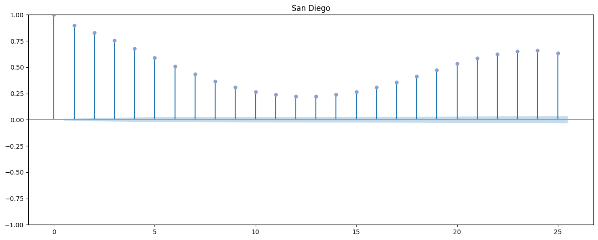
    

- As all lags are either close to 1 or at least greater than the confidence interval, they are statistically significant.
    - It checks how much today’s humidity is related to the humidity of previous days (1 day ago, 2 days ago, etc.).
    - Every lag (past day) still has a strong connection with the current day’s humidity.
    - In other words, humidity levels don’t change randomly — they follow a persistent and predictable pattern over time.

- `plot_acf` is a function for visualizing autocorrelation in time series data.   It is part of the `statsmodels` library and generates a plot showing the correlation of a time series with its own lagged values.
    - `plot_acf` is not defined directly in the provided file, it is imported and used from the `statsmodels.graphics.tsaplots` module.
    - Params:
        - `x`: Array-like, the time series data to analyze.
        - `lags`: Integer, number of lags to display on the x-axis (e.g., 25).
        - `title`: String, optional title for the plot.
    - Side effects:
        - Generates a matplotlib figure displaying autocorrelation values at each lag.
        - Requires `plt.show()` to render the plot in interactive environments.
    - Returns:
        - A matplotlib `Figure` object (not explicitly returned but created implicitly).

##### Partial AutoCorrelation


```python
# Partial Autocorrelation of humidity of San Diego
plot_pacf(humidity['San Diego'],lags=25, color = palette[2])
plt.show()
```
    
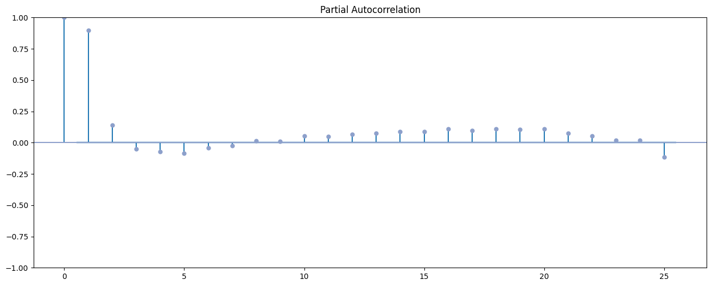
    

- Though it is statistically signficant, partial autocorrelation after first 2 lags is very low.


```python
# Partial Autocorrelation of closing price of microsoft stocks
plot_pacf(microsoft_stock["Close"],lags=25, color = palette[3])
plt.show()
```


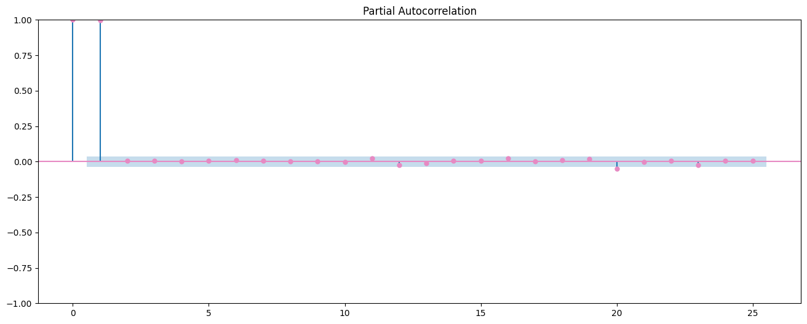
    


- Here, only 0th, 1st and 20th lag are statistically significant.
    - It measures how much today’s price is related to previous prices, after removing the indirect effects from the other days in between.
    - 0th lag → today’s value itself (always = 1, no meaning).
    - 1st lag → yesterday’s closing price has a real, direct influence on today’s price.
    - 20th lag → the price from about 20 trading days ago (≈ one month) also has a smaller but still statistically meaningful effect.
    - All other lags (2–19, 21–25) show no significant relationship, meaning those past days don’t add extra predictive power once yesterday and ~1-month-ago prices are known.
